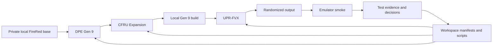

<div align="center">

# FireRed Gen 9 Randomizer Workspace

### A reproducible compatibility and validation workspace for combining a Gen 9 FireRed base with modern randomizer tooling.


</div>

> **Pin every component. Test every boundary. Keep protected artifacts out of version control.**

## Overview

FireRed Gen 9 Randomizer Workspace is the source of truth for a documented,
reproducible integration of:

- a FireRed-based game foundation;
- Generation 9 Pokémon data and expanded mechanics;
- Universal Pokémon Randomizer FVX;
- GBA build tooling;
- emulator validation;
- compatibility audits and targeted runtime smoke tests.

This repository is not a ROM hack download and does not distribute a playable
game. It coordinates the source repositories, pinned revisions, build
assumptions, compatibility decisions and test evidence needed to produce and
validate a private local setup.

The central question is not only whether the components compile independently,
but whether they continue to work correctly when combined, randomized, saved,
reloaded and executed in an emulator.

## Why this workspace exists

The integration crosses several independently evolving systems:

- expanded Pokémon species, forms, moves, abilities and data tables;
- engine and quality-of-life modifications;
- randomizer readers, writers and filtering rules;
- GBA build scripts, offsets and toolchain assumptions;
- emulator behavior and tracker expectations.

A change that appears valid in one component can break another in less obvious
ways. Examples include:

- a species table loading correctly but using incompatible form metadata;
- a randomizer option saving successfully but writing the wrong runtime source;
- a visual change altering the identifier used to discover field items;
- a trainer class label no longer matching its visible sprite;
- a valid build booting in one emulator but remaining unverified in the target
  tracker workflow.

The workspace turns those compatibility boundaries into explicit decisions,
pinned inputs and repeatable evidence.

## Target setup

| Layer | Role |
|---|---|
| **FireRed base** | Provides the underlying Game Boy Advance game structure. |
| **Dynamic Pokémon Expansion Gen 9** | Supplies expanded species, forms, sprites and Pokémon data. |
| **Complete FireRed Upgrade Expansion** | Supplies engine changes, mechanics and quality-of-life functionality. |
| **Universal Pokémon Randomizer FVX** | Reads the customized game and produces randomized outputs. |
| **GBA toolchain** | Builds the expanded local game from pinned source revisions. |
| **mGBA** | Current emulator used for targeted boot and runtime smoke checks. |
| **BizHawk** | Planned target for later compatibility validation. |
| **Ironmon Tracker** | Planned tracker integration and runtime validation target. |
| **This workspace** | Owns manifests, decisions, scripts, pins, test plans and sanitized evidence. |

## Integration flow



Protected game files remain local and ignored. The repository stores only the
documentation and legally uncritical tooling required to reproduce the
integration process.

## What this repository contains

- project scope and compatibility decisions;
- pinned branches and commit revisions for external components;
- source and tool manifests;
- setup and build guidance;
- small audit, bootstrap and validation scripts;
- randomizer compatibility analyses;
- sanitized smoke-test plans and results;
- roadmap, session state and handoff documents;
- rules for agent-assisted development;
- references to upstream and comparison projects.

## What this repository does not contain

- ROM files;
- randomized or patched game outputs;
- save files or emulator states;
- screenshots containing protected or private material;
- emulator, tracker or randomizer binaries;
- release archives and installer files;
- private absolute paths;
- tokens, secrets or `.env` files;
- copied proprietary game assets.

Possessing this repository alone is not sufficient to create a playable build.

## Compatibility principles

### Pin before changing

Every external component should be associated with a known branch and commit.
Compatibility evidence applies to those revisions, not automatically to future
upstream updates.

### Preserve ownership boundaries

Each component should remain responsible for its own domain:

- DPE owns expanded Pokémon data and representation;
- CFRU owns engine behavior and its source-backed extensions;
- UPR-FVX owns randomizer settings, selection rules and output writing;
- the workspace owns orchestration, documentation and cross-component evidence.

A compatibility change should not duplicate behavior already owned by another
component without a documented reason.

### Fail closed

Scripts and overlays validate expected source structure before writing.

When a known map, table, pointer, count or identifier no longer matches the
documented contract, the operation should stop instead of guessing.

### Separate evidence levels

The project distinguishes between:

- static source analysis;
- syntax or compile checks;
- successful local builds;
- randomizer load and save tests;
- emulator boot smoke;
- targeted runtime behavior;
- broad playthrough evidence;
- formal support claims.

Passing one level does not imply that all later levels have passed.

### Keep caveats visible

Targeted smoke tests are useful evidence, but they are not full-playthrough
proof. Unsupported combinations remain explicitly unsupported until the
required validation exists.

## Current status

| Area | Status |
|---|---|
| Workspace structure and documentation | Established |
| External source pinning | Established and actively maintained |
| GBA toolchain availability | Locally confirmed |
| DPE Gen 9 local build | Targeted local build pass |
| CFRU local build | Targeted local build pass |
| UPR-FVX source build and GUI start | Locally confirmed |
| Customized game load in UPR-FVX | Locally confirmed |
| Randomizer compatibility work | Broad targeted coverage with explicit caveats |
| mGBA boot | Targeted local boot pass |
| Runtime smoke evidence | Available for selected features and compatibility paths |
| Full playthrough validation | Not established |
| BizHawk compatibility | Pending |
| Ironmon Tracker integration | Pending |
| General support or release status | Not claimed |

Current work focuses on compatibility hardening, Pokémon data alignment,
randomizer behavior, source-backed quality-of-life changes and repeatable
runtime evidence.

The detailed and fast-changing status belongs in the project-control and
handoff documents rather than in this README.

## Getting started

### Prerequisites

The exact requirements depend on the pinned component revisions, but the local
workspace generally expects:

- Git with submodule support;
- Python 3;
- Java for UPR-FVX;
- devkitPro/devkitARM and `arm-none-eabi-gcc`;
- `make`;
- a compatible emulator;
- a legally obtained private FireRed base stored only in an ignored local
  directory.

This repository does not provide or link to ROM downloads.

### Clone the workspace

After the proposed repository rename:

```bash
git clone --recurse-submodules \
  https://github.com/Planton361/firered-gen9-randomizer.git

cd firered-gen9-randomizer
```

For an existing checkout:

```bash
git submodule update --init --recursive
```

### Read the active project state

Start with:

1. [`01_docs/PROJECT_BRIEF.md`](./01_docs/PROJECT_BRIEF.md)
2. [`00_project-control/roadmap/roadmap-status.md`](./00_project-control/roadmap/roadmap-status.md)
3. [`01_docs/SESSION_STATE.md`](./01_docs/SESSION_STATE.md)
4. [`01_docs/NEXT_STEPS.md`](./01_docs/NEXT_STEPS.md)
5. [`01_docs/references/tool-manifest.md`](./01_docs/references/tool-manifest.md)

The newest entries in the status and handoff files supersede older historical
entries below them.

### Prepare the local environment

Follow:

- [`01_docs/setup/workspace-build-randomizer-integration-plan.md`](./01_docs/setup/workspace-build-randomizer-integration-plan.md)
- the currently pinned component documentation;
- the relevant test plan under [`08_tests/`](./08_tests/).

Build commands and expected outputs may change with component pins. Do not copy
commands from an older session without checking the current manifest.

### Validate in stages

A typical compatibility cycle is:

```text
Refresh and verify source pins
   ↓
Run read-only audits and fail-closed checks
   ↓
Build DPE
   ↓
Build CFRU against the expected DPE output
   ↓
Build or launch the pinned UPR-FVX revision
   ↓
Load and randomize the private local build
   ↓
Reload the generated settings or output where required
   ↓
Boot in the selected emulator
   ↓
Run the targeted smoke matrix
   ↓
Record sanitized evidence and caveats
```

Do not promote a feature beyond the evidence level actually completed.

## Repository structure

```text
firered-gen9-randomizer/
├── 00_project-control/
│   └── roadmap/              # Roadmap and high-level project status
├── 01_docs/
│   ├── analysis/             # Source-backed compatibility investigations
│   ├── setup/                # Environment and integration guidance
│   ├── quality/              # Quality and validation rules
│   └── references/           # Sources, tools, versions and pinned revisions
├── 02_external/              # External source checkouts or submodules
├── 03_tools/
│   └── releases/             # Local ignored binaries and archives
├── 04_private_roms/          # Local ignored private game files
├── 05_builds/                # Local ignored build outputs
├── 06_patches/               # Approved non-protected patch metadata or recipes
├── 07_scripts/               # Audits, bootstrap helpers and safety checks
└── 08_tests/                 # Test plans and sanitized evidence
```

The exact contents of ignored directories are local environment details and
must not be inferred from Git history.

## Testing strategy

The repository uses narrow, evidence-driven validation rather than broad
unsupported claims.

### Static and structural checks

These verify assumptions without running the game:

- source and commit pin checks;
- table shape and count validation;
- alias and mapping audits;
- fail-closed map or object checks;
- syntax and compile checks;
- clean repository state;
- generated-output exclusion checks.

### Randomizer checks

Depending on the feature, tests may verify:

- the customized game is recognized;
- settings can be applied without exceptions;
- output can be saved and reloaded;
- generation limits and form filters behave as expected;
- trainer, field-item and held-item paths retain valid pools;
- relevant mismatch and fallback counters remain zero;
- base and randomized outputs differ where expected.

### Runtime smoke checks

Targeted emulator tests verify selected behavior such as:

- successful boot;
- visible species, palettes or trainer sprites;
- rival and starter consistency;
- field-item pickup and persistence;
- map load, NPC interaction and event preservation;
- save and reload behavior;
- absence of crashes, freezes or visibly corrupted graphics.

These tests are scoped. They do not imply full game completion.

## Current engineering themes

### Gen 1–9 data synchronization

External data sources are used as references through reviewed aliases,
fail-closed dry runs and narrow field-family updates. Unsupported forms,
behavior-sensitive abilities and unresolved representations remain blocked
instead of being silently written.

### Randomizer compatibility

UPR-FVX compatibility work focuses on correctly reading and writing the
customized FireRed structures while preserving explicit boundaries between
species, forms, mechanics, trainers, items and source-specific runtime data.

### Source-backed engine changes

CFRU modifications are implemented only where the source provides a defensible
extension point. Raw-address ports, opaque binary replacements and fragile
runtime hooks are rejected when they cannot be validated safely.

### Quality-of-life behavior

Existing CFRU behavior is first inventoried and preserved. New convenience
features are introduced through narrow pilots, fail-closed structural checks
and dedicated runtime matrices.

## Documentation map

| Document | Purpose |
|---|---|
| [`01_docs/PROJECT_BRIEF.md`](./01_docs/PROJECT_BRIEF.md) | Stable project purpose and boundaries |
| [`00_project-control/roadmap/roadmap-status.md`](./00_project-control/roadmap/roadmap-status.md) | Current roadmap-level status |
| [`01_docs/SESSION_STATE.md`](./01_docs/SESSION_STATE.md) | Latest implementation and validation handoff |
| [`01_docs/NEXT_STEPS.md`](./01_docs/NEXT_STEPS.md) | Immediate follow-up work and gates |
| [`01_docs/DECISIONS_INDEX.md`](./01_docs/DECISIONS_INDEX.md) | Index of accepted technical decisions |
| [`01_docs/references/source-index.md`](./01_docs/references/source-index.md) | External sources and reference projects |
| [`01_docs/references/tool-manifest.md`](./01_docs/references/tool-manifest.md) | Tool versions, branches, commits and local assumptions |
| [`08_tests/`](./08_tests/) | Smoke plans, compatibility matrices and sanitized evidence |
| [`AGENTS.md`](./AGENTS.md) | Repository rules for coding agents |

## Upstream projects and references

This workspace coordinates and credits work from multiple projects, including:

- [Universal Pokémon Randomizer FVX](https://github.com/upr-fvx/universal-pokemon-randomizer-fvx)
- [CFRU Expansion](https://github.com/Shiny-Miner/CFRU-expansion)
- [Dynamic Pokémon Expansion Gen 9](https://github.com/Shiny-Miner/Dynamic-Pokemon-Expansion-Gen-9)
- [Complete FireRed Upgrade](https://github.com/Skeli789/Complete-Fire-Red-Upgrade)
- [Dynamic Pokémon Expansion](https://github.com/Skeli789/Dynamic-Pokemon-Expansion)
- [pret/pokefirered](https://github.com/pret/pokefirered)

Additional reference projects and exact pinned revisions are documented in the
source index and tool manifest.

This repository does not claim ownership of upstream code, Pokémon, FireRed or
associated trademarks and assets.

## Scope and limitations

- The workspace targets a specific customized FireRed integration rather than
  every Gen 3 ROM hack.
- Compatibility evidence is revision-specific.
- Many results are targeted smoke tests rather than complete playthroughs.
- mGBA evidence does not automatically imply BizHawk compatibility.
- Randomizer success does not automatically imply Ironmon Tracker support.
- Protected inputs and generated outputs remain local.
- Public documentation omits private paths, raw logs, hashes and artifacts that
  could expose protected material.
- A successful local setup may still require platform-specific troubleshooting.

## Roadmap

The next major objectives are:

1. keep the workspace pins aligned with merged compatibility branches;
2. complete the remaining gated randomizer and runtime smoke matrices;
3. continue controlled Gen 1–9 data alignment;
4. harden source-backed CFRU quality-of-life changes;
5. expand regression coverage for randomized outputs;
6. validate BizHawk behavior;
7. validate Ironmon Tracker integration;
8. define a stable support profile only after the required evidence exists.

## Project principle

```text
Reproducible inputs.
Explicit ownership.
Fail-closed changes.
Evidence before support.
```
